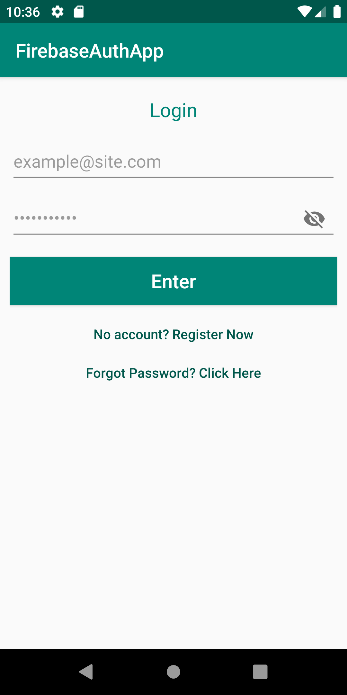
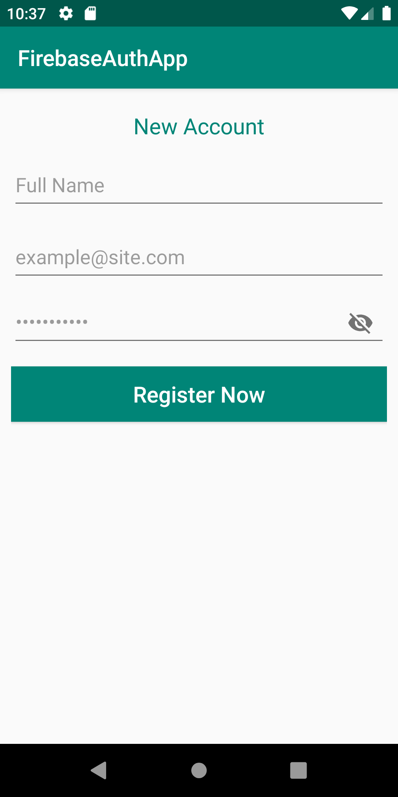
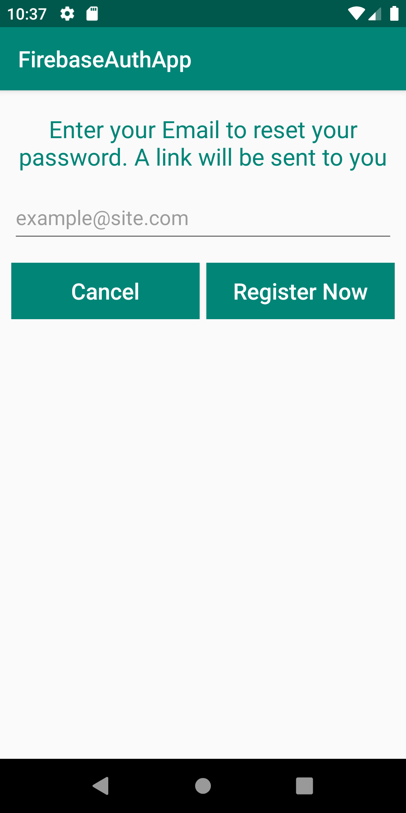
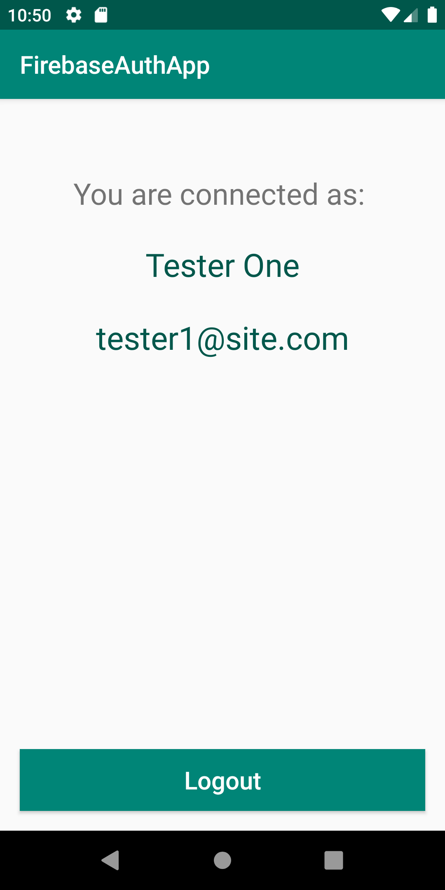

# FireBase Auth App

This app includes:

* Login
* Signup
* Password recover
* Logout

Here are some tasks to perform to make the app work:

* Create and Configure the Firebase project
* Enable the email authentication on the project
* Create the firestore database and add a basic rule like 
`allow read, write: if request.auth.uid != null`
* Include the firebase json file in project
* Fix dependencies issues, if any

